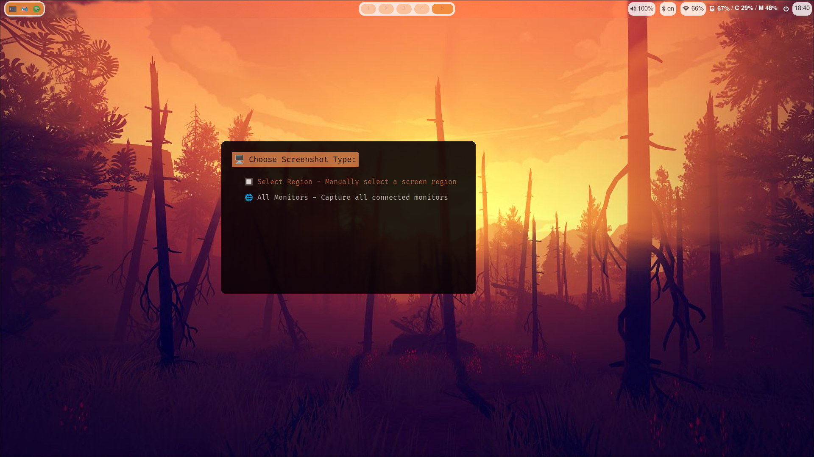

# rofi-screenshot-wayland

`rofi-screenshot-wayland` is a tool that leverages the power of Rofi to capture screenshots in Wayland environments. It's designed to be fast, efficient, and highly customizable, offering a user-friendly interface for capturing various types of screenshots.

## Screenshot



## Current Features

- Capture the entire screen, a specific window, or a selected region.
- Save screenshots in PNG or JPG format.
- Copy screenshots directly to the clipboard.
- Screenshot delay

## Work in Progress

This project is currently a work in progress. Upcoming features include:

- Capture from a specific screen.
- Capture a specific client window by name or ID.

## Installation

To install `rofi-screenshot-wayland`, simply place the `.sh` file in a directory that is in your system's PATH. For example:

```bash
cp rofi-screenshot-wayland.sh /usr/local/bin/
```

Make sure the script is executable:

```bash
chmod +x /usr/local/bin/rofi-screenshot-wayland.sh
```

## Dependencies

`rofi-screenshot-wayland` requires the following dependencies:

- `grim`: For capturing screenshots.
- `slurp`: For selecting regions on the screen.
- `wl-clipboard`: For clipboard support.
- `libnotify`: For sending desktop notifications.
- `rofi`: For the user interface.

Ensure these are installed on your system for full functionality. Installation can typically be done through your package manager.

## Contributing

Contributions are what make the open-source community an amazing place to learn, inspire, and create. Any contributions you make are **greatly appreciated**.

If you have a suggestion that would make this better, please fork the repo and create a pull request. You can also simply open an issue with the tag "enhancement".

Don't forget to give the project a star! Thanks again!
